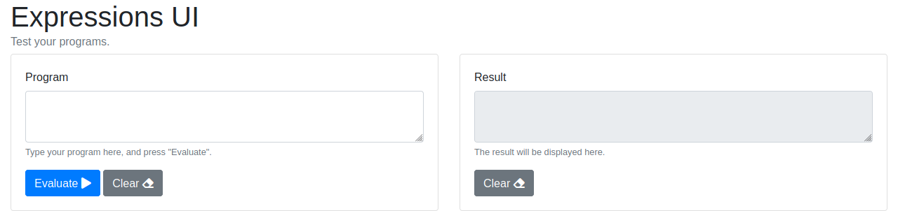

# expressions-api
API for configuring and running expressions.

## Examples

### Simple evaluation

You can use the API in several modes. The simplest one is to just pass the expressions in the payload along
with the parameters, like this:

    curl -X POST http://localhost:8080/expressions/evaluate \
        -H "Content-Type: application/json" \
        -d '{
            "expressions": [
                "a+b",
                "c = \"hello, world!\""
            ],
            "parameters": {
                "a": 1,
                "b": 2,
                "c": "hello, world!"
            }
        }'

This call will return this...

    [
        {
            "expression":"a+b",
            "result":3
        },
        {
            "expression":"c = \"hello, world!\"",
            "result":true
        }
    ]

### Storing and evaluationg functions

You can store a function with a POST to `/functions/{id}`:

    curl -X POST http://localhost:8080/functions/test \
        -H "Content-Type: application/json" \
        -d '{
            "defintion": "f(x) <- x+1; f(a)"
        }'

Once stored, you can evaluate it passing parameters:

    curl -X POST http://localhost:8080/functions/test/evaluation \
        -H "Content-Type: application/json" \
        -d '{
            "a": 2
        }'

This will return:

    {
        "expression": "f(x) <- x+1; f(a)",
        "result": 3
    }

## User interface

Enter [http://localhost:8080/index.html](http://localhost:8080/index.html):

